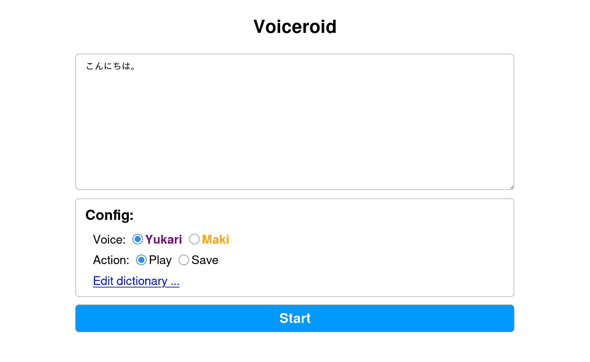

# Voiceroid+ in docker (also on Raspberry Pi)

Run voiceroid+ in docker on x64 or arm64 linux.
Supports original versions of Yukari/Maki, ones released in 2010-2011.

Tested on Arch Linux (x64) and Nvidia Jetsons (ubuntu 20/22).  Should also work on other Arm SBCs (`${fruit}Pi`s) but unstable with 2GB or lower ram (likely due to wine overhead).

Note: this repository does not contain the actual voiceroid executables, libraries or its assets. (= no copyright violation!) You have to bring them from existing installations.

### Technical notes

This spawns a headless X11 session to run Voiceroid+ via `wine` (and `box64` & `box86` for x64-on-arm emulation on arm host, this requires a different build of `wine`), then uses X11 automation to interact with the apps.

You can call voiceroid via an HTTP api / web interface.

Long requests are splitted to chunks (\~1800 chars) before getting passed to voiceroid in order to avoid memory exhaustion. Further, the first chunks are shorter (\~100 chars) to minimize request-response latency before you can start listening to the audio (a few seconds) even if processing of the entire request takes minutes. Chunk splitting is performed at punctations to ensure each word/sentence is not splitted.


## Building

1. Install voiceroid on a (windows) machine.

2. Copy `AHS` folder as `assets/root1/Voiceroid/AHS`.

3. Build the docker image:
```
sudo make build_x64    # on x64
sudo make build_arm64  # on arm64
```

Note, qemu-user-static-binfmt is required for building arm64 image on x64 machine


## Usage

1. Run the docker image (you have to wait a while for startup):
```
$ sudo make run
```

2. Access API from command line or web browser at http://localhost:2137

2-1. From command line using `curl`:
```
$ curl 'localhost:2137?q=こんにちは' > voice.mp3
$ curl 'localhost:2137' -d 'q=こんにちは' > voice.mp3
```

2-2. From web browser, open http://localhost:2137, enter `こんにちは` in the text box, and click the start button.




## Request parameters

Complete example of a request url:

```
http://localhost:2137?q=<text>&voice=<voice>
```

- `q` is the text to be processed.
- `voice` is the name of the voice to be used (`yukari` (default) or `maki`)
- use `application/x-www-form-urlencoded` for POST requests


## User dictionary

Copy `udic/` to some other path and set as `$udic_dir` when running:

```
sudo "udic_dir=$(pwd)/udic2" make run
```

Check `udic/user.dic.utf8` for dictionary format (you can also copy from existing installations).


## Tip: faster build

When building docker images repeatedly, use a caching proxy to save network usage:
```
$ python apt-cache-proxy.py 4444 & pid=$!
$ sudo http_proxy=http://172.17.0.1:4444 make build_x64
$ kill $pid
```
